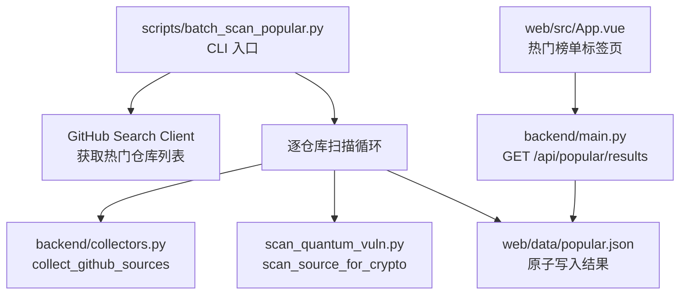

# Design Document: Popular Repo Batch Scan

## Overview

本功能为抗量子迁移风险扫描平台新增"热门仓库批量扫描"能力。通过一次性 CLI 脚本从 GitHub Search API 获取 star 数最高的 Python 仓库，逐一执行量子脆弱性扫描，将结果写入静态 JSON 文件，并在前端新增"热门榜单"标签页展示数据。

**设计决策：**
- **无数据库/队列/调度器**：一次性 CLI 执行，结果持久化为静态 JSON 文件，FastAPI 直接读取返回。这保持了项目零外部依赖的特点。
- **复用现有组件**：直接调用 `backend/collectors.py` 的 `collect_github_sources` 和 `scan_quantum_vuln.py` 的 `scan_source_for_crypto`，不重复实现采集和扫描逻辑。
- **顺序扫描**：由于 GitHub API 有速率限制，且仓库数量固定（默认 20），顺序处理足够且更可控。
- **原子写入**：通过 temp file + rename 确保前端不会读到半写的 JSON 文件。

## Architecture



**数据流：**
1. CLI 脚本调用 GitHub Search API → 获取 top-N 仓库元数据
2. 对每个仓库调用 `collect_github_sources` 下载源码 → 调用 `scan_source_for_crypto` 扫描
3. 汇总结果，原子写入 `web/data/popular.json`
4. FastAPI 新增 GET 端点读取该文件返回给前端
5. 前端"热门榜单"标签页展示数据

## Components and Interfaces

### 1. `scripts/batch_scan_popular.py` — CLI 批量扫描脚本

**职责：** 编排整个批量扫描流程。

```python
# 主要函数签名
def fetch_popular_repos(top: int = 20, token: str | None = None) -> list[RepoInfo]
def scan_single_repo(repo: RepoInfo) -> RepoScanResult
def run_batch_scan(top: int = 20) -> BatchResult
def write_results(result: BatchResult, output_path: Path) -> None
def main() -> int
```

**依赖：**
- `httpx` — 调用 GitHub Search API
- `backend.collectors.collect_github_sources` — 下载仓库源码
- `scan_quantum_vuln.scan_source_for_crypto` — 扫描单个源文件
- `scan_quantum_vuln.build_migration_score` — 计算迁移评分
- `backend.reporting.beijing_now_iso` — 生成北京时间戳

### 2. `backend/main.py` — 新增 GET `/api/popular/results` 端点

**职责：** 读取静态 JSON 文件并返回。

```python
@app.get("/api/popular/results")
def get_popular_results() -> Response:
    """读取 web/data/popular.json 并返回其内容。"""
```

**错误处理：**
- 文件不存在 → 404
- JSON 解析失败 → 502
- I/O 错误 → 500

### 3. `web/src/App.vue` — 热门榜单标签页

**职责：** 展示批量扫描结果列表，支持展开查看详情。

**新增状态：**
```javascript
const popularData = ref(null)
const popularLoading = ref(false)
const popularError = ref('')
const expandedPopularRepo = ref(null)
```

**新增函数：**
```javascript
async function loadPopularData() { /* GET /api/popular/results */ }
function formatStarCount(count) { /* 52300 → "52.3k" */ }
function formatScannedAt(isoString) { /* ISO → "YYYY-MM-DD HH:mm:ss" */ }
function getScoreColor(score) { /* score → red/orange/green */ }
function toggleRepoDetail(repoIndex) { /* 展开/折叠详情 */ }
```

## Data Models

### BatchResult（CLI 输出 JSON 结构）

```json
{
  "scanned_at": "2024-01-15T14:30:00+08:00",
  "repos": [
    {
      "full_name": "pallets/flask",
      "star_count": 68000,
      "url": "https://github.com/pallets/flask",
      "migration_score": 45,
      "finding_count": 3,
      "algorithms": ["RSA", "ECDSA"],
      "findings": [
        {
          "line": 42,
          "file_name": "src/crypto.py",
          "algorithm": "RSA",
          "risk_level": "高风险",
          "evidence": "rsa.generate_private_key"
        }
      ]
    }
  ],
  "meta": {
    "total_repos": 18,
    "requested_count": 20,
    "query": "language:python sort:stars"
  }
}
```

### RepoInfo（内部数据类）

```python
@dataclass
class RepoInfo:
    full_name: str      # "owner/repo"
    html_url: str       # "https://github.com/owner/repo"
    star_count: int     # star 数
```

### RepoScanResult（内部数据类）

```python
@dataclass
class RepoScanResult:
    full_name: str
    star_count: int
    url: str
    migration_score: int
    finding_count: int
    algorithms: list[str]       # 去重后的算法名列表
    findings: list[dict]        # 最多 20 条，按 line 升序
    success: bool
    error: str | None = None
```

### 迁移评分公式

复用现有 `build_migration_score` 逻辑：
```
score = min(100, high_risk_count × 25 + affected_file_count × 10 + algorithm_variety × 10)
```

阈值：
- `score >= 40` → 高风险（红色）
- `0 < score < 40` → 中风险（橙色）
- `score == 0` → 低风险（绿色）

## Correctness Properties

*A property is a characteristic or behavior that should hold true across all valid executions of a system—essentially, a formal statement about what the system should do. Properties serve as the bridge between human-readable specifications and machine-verifiable correctness guarantees.*

### Property 1: Fault tolerance preserves remaining scans

*For any* list of repositories and any single repository that fails during collection, the batch scanner SHALL still produce scan results for all other repositories in the list, and the failed repository SHALL be recorded with a failure reason.

**Validates: Requirements 2.3**

### Property 2: Migration score computation is correct

*For any* set of scan findings, the computed migration score SHALL equal `min(100, high_risk_count × 25 + affected_file_count × 10 + algorithm_variety × 10)`, where high_risk_count is the number of findings with risk_level containing "高", affected_file_count is the number of distinct file names with findings, and algorithm_variety is the number of distinct algorithm names.

**Validates: Requirements 2.4**

### Property 3: Findings are capped and sorted

*For any* repository scan producing N findings, the output SHALL contain at most 20 findings, and those findings SHALL be sorted by line number in ascending order.

**Validates: Requirements 2.5, 7.2**

### Property 4: JSON serialization produces valid structure with Chinese preserved

*For any* valid batch result containing Chinese characters, serializing to JSON with `ensure_ascii=False` and 2-space indentation SHALL produce a file that: (a) parses back to an equivalent data structure (round-trip), (b) contains `scanned_at` as an ISO string ending with `+08:00`, (c) contains a `repos` array, (d) contains a `meta` object with `total_repos`, `requested_count`, and `query` fields, and (e) Chinese characters appear literally (not as `\uXXXX` escapes).

**Validates: Requirements 3.2, 3.4**

### Property 5: API endpoint returns file content verbatim

*For any* valid JSON content written to `web/data/popular.json`, the GET `/api/popular/results` endpoint SHALL return a response whose body is byte-for-byte identical to the file content.

**Validates: Requirements 4.1, 4.4**

### Property 6: Score color classification matches thresholds

*For any* integer migration score in [0, 100], the color classification SHALL be: red (高风险) if score >= 40, orange (中风险) if 0 < score < 40, green (低风险) if score == 0.

**Validates: Requirements 6.3**

### Property 7: Timestamp formatting removes ISO artifacts

*For any* valid ISO 8601 timestamp string with `+08:00` timezone suffix, the formatting function SHALL produce a string matching the pattern `YYYY-MM-DD HH:mm:ss` (replacing 'T' with space, removing timezone suffix).

**Validates: Requirements 6.4**

### Property 8: Star count abbreviation

*For any* non-negative integer star count, if the count is >= 1000, the display function SHALL produce a string with "k" suffix representing the value divided by 1000 with one decimal place (e.g., 52300 → "52.3k"). If the count is < 1000, it SHALL be displayed as the integer itself.

**Validates: Requirements 6.6**

### Property 9: Repository list sorted by star count descending

*For any* list of repository results, the displayed order SHALL be sorted by star_count in descending order (highest stars first).

**Validates: Requirements 6.2**

## Error Handling

### CLI 脚本错误处理

| 错误场景 | 处理方式 | 退出码 |
|---------|---------|--------|
| GitHub Search API 速率限制 (403/429) | 日志提示设置 GITHUB_TOKEN，终止 | 非零 |
| GitHub Search API 其他 HTTP 错误 | 日志记录状态码，终止 | 非零 |
| GitHub Search API 超时 (>20s) | 日志记录超时，终止 | 非零 |
| 单个仓库采集失败 | 记录失败原因，跳过，继续 | 0（部分成功） |
| 输出文件写入失败 | stderr 输出错误，清理临时文件 | 非零 |
| 仓库列表为空 | 正常输出空结果 | 0 |

### API 端点错误处理

| 错误场景 | HTTP 状态码 | 响应体 |
|---------|------------|--------|
| `popular.json` 不存在 | 404 | `{"detail": "热门仓库扫描数据尚未生成，请先运行批量扫描脚本"}` |
| `popular.json` 非法 JSON | 502 | `{"detail": "热门仓库数据文件损坏，请重新运行批量扫描脚本"}` |
| 文件读取 I/O 错误 | 500 | `{"detail": "读取热门仓库数据文件失败"}` |

### 前端错误处理

| 错误场景 | 用户提示 |
|---------|---------|
| API 返回 404 | "暂无数据，请先运行批量扫描脚本生成热门仓库数据" |
| API 返回其他错误或网络失败 | "加载热门仓库数据失败" |
| 请求超时 (15s) | "加载热门仓库数据失败" |
| 返回空 repos 数组 | "暂无数据，请先运行批量扫描脚本生成热门仓库数据" |

## Testing Strategy

### Property-Based Tests (PBT)

使用 Python `hypothesis` 库，每个 property test 运行至少 100 次迭代。

**适用 PBT 的属性：**
- Property 2 (迁移评分计算) — 纯函数，输入空间大
- Property 3 (findings 截断排序) — 纯数据变换
- Property 4 (JSON 序列化结构) — 序列化 round-trip
- Property 6 (分数颜色分类) — 纯函数，输入空间 [0,100]
- Property 7 (时间戳格式化) — 纯函数
- Property 8 (star 数缩写) — 纯函数
- Property 9 (star 排序) — 排序不变量

**PBT 库选择：** `hypothesis`（Python 生态标准 PBT 库）

**配置：**
- 每个 property test 最少 100 examples
- 每个 test 函数注释标注对应的 design property
- Tag 格式：`# Feature: popular-repo-batch-scan, Property N: <property_text>`

### Unit Tests (Example-Based)

使用 `unittest` + `unittest.mock`，与项目现有测试风格一致。

**CLI 脚本测试 (`tests/test_batch_scan.py`)：**
- mock `httpx.Client` 验证 GitHub Search API 调用参数
- mock `collect_github_sources` 和 `scan_source_for_crypto` 验证编排逻辑
- 验证 `--top` 参数解析
- 验证进度输出和摘要格式
- 验证退出码（成功/失败场景）

**API 端点测试 (`tests/test_backend_api.py` 新增)：**
- 文件存在 → 200 + 正确内容
- 文件不存在 → 404 + 正确错误消息
- 文件内容非法 JSON → 502
- mock I/O 错误 → 500

**前端测试：**
- 项目当前无前端测试框架，前端逻辑通过手动验证
- 纯函数（`formatStarCount`, `formatScannedAt`, `getScoreColor`）可在 PBT 中用 JavaScript 等价实现验证，但当前项目约定不引入前端测试框架
- 前端 property 6/7/8 的逻辑足够简单，通过 Python 端的等价函数测试覆盖

### Integration Tests

- CLI 端到端测试：mock 外部 HTTP 调用，验证完整流程从 fetch → scan → write
- 不发起真实网络请求（遵循项目约定）
